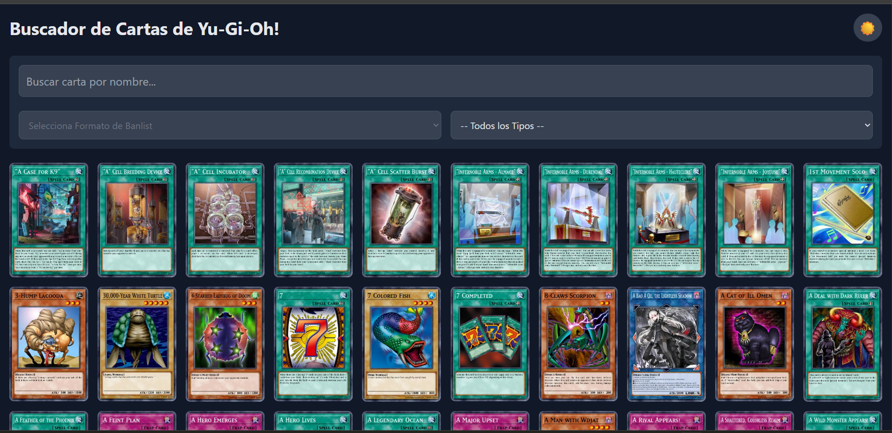

# 🃏 Buscador de Cartas de Yu-Gi-Oh!

---

**[Ver Demo en Vivo](https://yugioh-card-finder.vercel.app/)**

---



---

## ✨ Características Principales

* **Búsqueda en Tiempo Real**: Filtra cartas por nombre con una función de "debounce" para optimizar las llamadas a la API.
* **Filtros Avanzados**: Combina filtros por Banlist (TCG, OCG, GOAT) y por Tipo de Carta.
* **Paginación del Lado del Servidor**: Carga inicial casi instantánea y navegación fluida a través de miles de cartas.
* **Vista de Detalle**: Haz clic en cualquier carta para navegar a una vista dedicada con toda su información.
* **Tema Claro y Oscuro**: Un interruptor para cambiar entre temas, con la preferencia guardada en el navegador.
* **Diseño Responsivo (Mobile-First)**: La interfaz se adapta perfectamente a cualquier tamaño de pantalla, desde móviles hasta escritorios.
* **UI Pulida**: Incluye efectos de "hover", animaciones de transición suaves y un "skeleton loader" para una mejor experiencia de usuario.

---

## 🛠️ Tecnologías Utilizadas

* **Framework Frontend:** [Vue.js 3](https://vuejs.org/) (Composition API)
* **Build Tool:** [Vite](https://vitejs.dev/)
* **Gestión de Estado:** [Pinia](https://pinia.vuejs.org/)
* **Routing:** [Vue Router](https://router.vuejs.org/)
* **Framework CSS:** [Tailwind CSS](https://tailwindcss.com/)
* **Librería de Utilidades:** [@vueuse/core](https://vueuse.org/) (para persistencia en `localStorage`)
* **Fuente de Datos:** [YGOPRODeck API](https://db.ygoprodeck.com/api-guide/)

---

## 🚀 Cómo Ejecutar Localmente

1.  **Clonar el repositorio:**
    ```bash
    git clone [https://github.com/TU_USUARIO/yugioh-card-finder.git](https://github.com/TU_USUARIO/yugioh-card-finder.git)
    ```

2.  **Navegar a la carpeta del proyecto:**
    ```bash
    cd yugioh-card-finder
    ```

3.  **Instalar dependencias:**
    ```bash
    npm install
    ```

4.  **Iniciar el servidor de desarrollo:**
    ```bash
    npm run dev
    ```

---